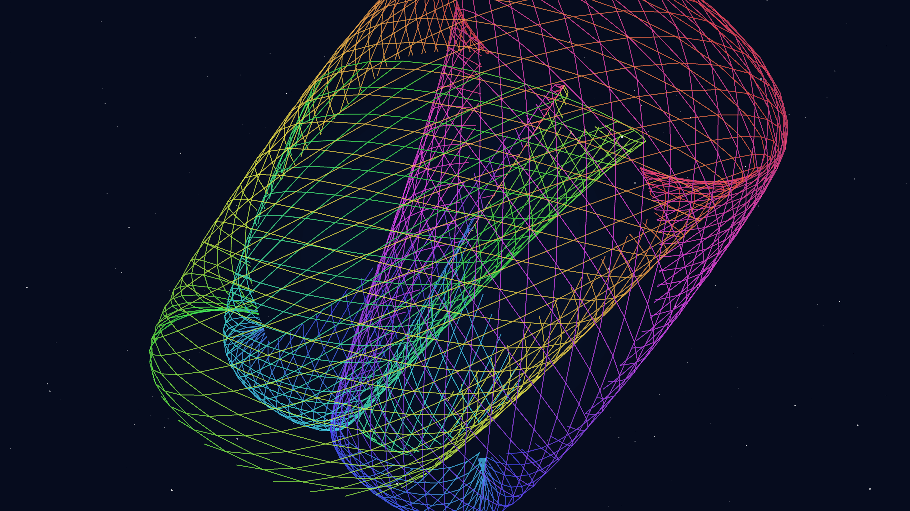

# string_theory_manifold

## Metadata
- **Date**: 2026-05-05
- **Theme**: Calabi-Yau manifolds, higher dimensions, hidden geometry, beautiful night sky.
- **Technique**: 3D parametric surface (P3D) based on nested complex trigonometric transformations, dynamic breathing via harmonic modulation, high-density starfield with localized alpha twinkle, HSB-based iridescent wireframe rendering, 60fps high-quality MP4 encoding.
- **Logic Lab Reference**: None

## Concept
A complex, shimmering geometric form that appears to rotate and fold into itself, revealing hidden symmetries in a silent cosmic void of deep indigo and distant stars.

## Technical Details
- **Renderer**: P3D
- **Simulation**: 3D parametric surface (P3D) based on nested complex trigonometric transformations, dynamic breathing via harmonic modulation, high-density s.
- **Visuals**: HSB spectral mapping, bloom-like highlights, prismatic color, dark-field contrast.
- **Animation**: 10 seconds at 60fps
