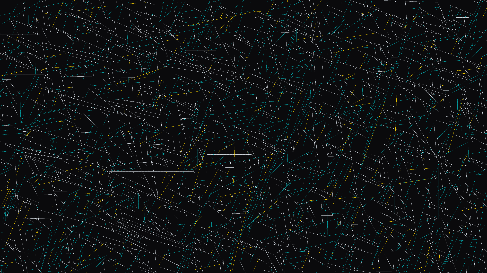

# substrate_crystal_growth

## Metadata
- **Date**: 2026-05-30
- **Theme**: A high-speed macro recording of microscopic bismuth crystals rapidly growing, colliding, and freezin
- **Technique**: Unknown
- **Logic Lab Reference**: 

## Concept
A high-speed macro recording of microscopic bismuth crystals rapidly growing, colliding, and freezing into perfect right-angled geometric networks on a frosted glass slide.

## Technical Details
- **Renderer**: Unknown
- **Simulation**: Unknown
- **Visuals**: Unknown
- **Animation**: Unknown
