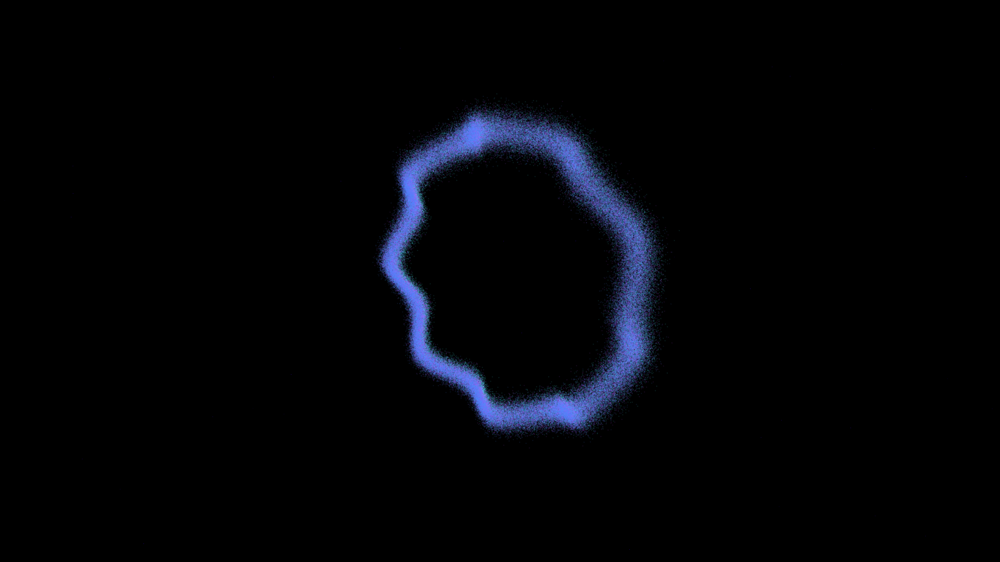

# superfluid_helicity_resonance

## Metadata
- **Date**: 2026-05-10
- **Theme**: Superfluidity, vortex helicity, Kelvin waves, quantum turbulence, beautiful night sky.
- **Technique**: 3D particle simulation (240,000 tracers) advected by helical harmonic perturbations (Kelvin waves) along three interacting vortex rings. Features manual 3D-to-2D projection with multi-pass additive point rendering for a soft "ghostly" glow.
- **Logic Lab Reference**: None

## Concept
A majestic visualization of quantum fluid dynamics; silken filaments of electric ice and ghostly amethyst light weave and twist in a helical resonance, tracing the hidden paths of superfluid vortex rings as they dance against the star-dusted obsidian void.

## Technical Details
- **Renderer**: P2D
- **Simulation**: particle, 3D particle.
- **Visuals**: additive blending, HSB spectral mapping, bloom-like highlights.
- **Animation**: 20 seconds at 60fps
