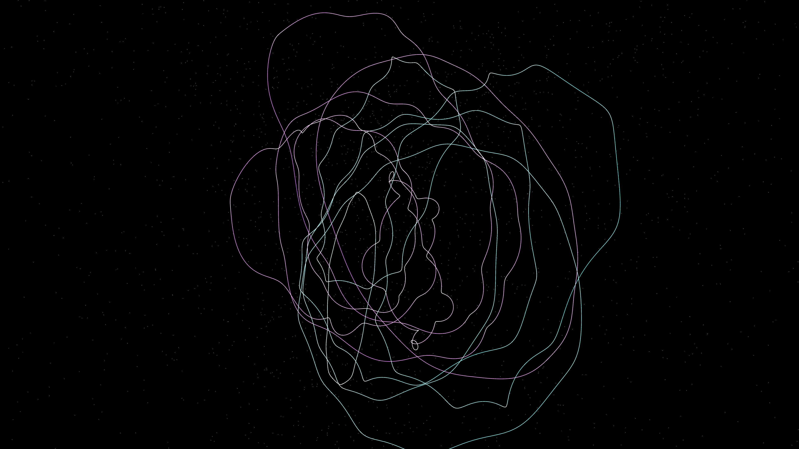

# superfluid_kelvin_waves

## Metadata
- **Date**: 2026-05-07
- **Theme**: Superfluidity, Kelvin waves, vortex line oscillation, quantum turbulence, beautiful night sky.
- **Technique**: 3D particle simulation (120,000 particles) sampled along 12 closed-loop vortex filaments. Filaments are modulated by multiple helical harmonic oscillators (Kelvin waves) using vectorized NumPy. Features multi-pass additive rendering with HSB spectral mapping (Teal/Violet/White) and a high-density starfield (10,000 stars). 60fps high-bitrate MP4.
- **Logic Lab Reference**: None

## Concept
A majestic vision of quantum fluids; silken loops of electric teal and royal violet light oscillate with high-frequency helical ripples, appearing like cosmic threads vibrating in a silent star-dusted void.

## Technical Details
- **Renderer**: P3D
- **Simulation**: Vectorized NumPy, NumPy, particle.
- **Visuals**: additive blending, HSB spectral mapping, bloom-like highlights, prismatic color, dark-field contrast.
- **Animation**: 10 seconds at 60fps
