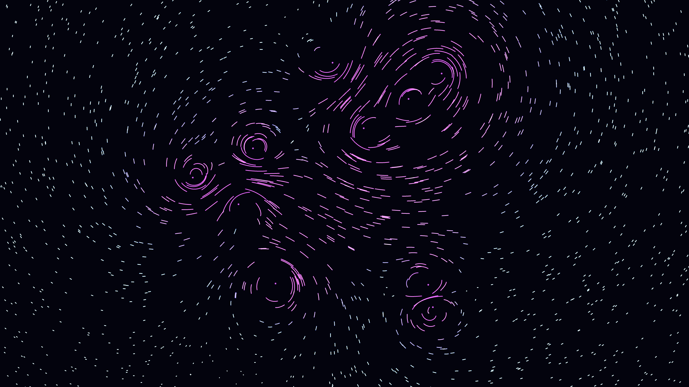

# superfluid_tangle

## Metadata
- **Date**: 2026-05-03
- **Theme**: physics, fluid dynamics, quantum turbulence.
- **Technique**: 2D Biot-Savart point-vortex simulation, 3000-particle flow field, HSB velocity mapping, additive trail synthesis.
- **Logic Lab Reference**: None

## Concept
A dense, glowing web of electric cyan and violet filaments swirling around ten hidden vortex cores; a visualization of frictionless quantum turbulence with long, liquid-like trails against a dark navy void.

## Technical Details
- **Renderer**: P2D
- **Simulation**: particle, flow field.
- **Visuals**: additive blending, HSB spectral mapping, persistent trails, bloom-like highlights, prismatic color, dark-field contrast.
- **Animation**: 5 seconds at 60fps
