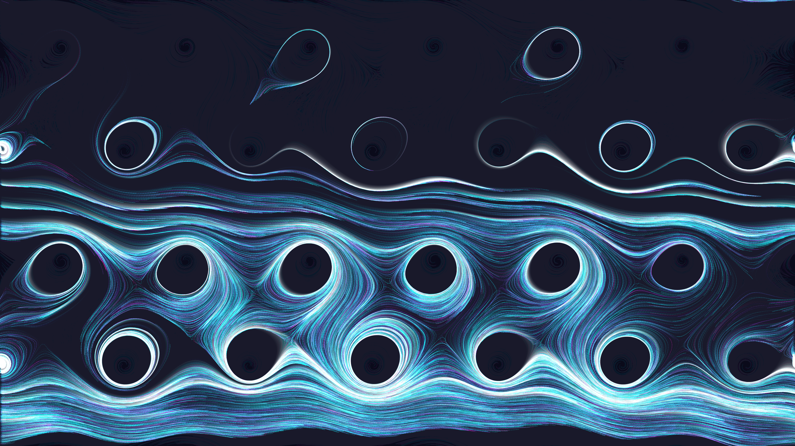

# superfluid_vortex_lattice_2d

## Metadata
- **Date**: 2026-05-27
- **Theme**: - **Date**: 2026-05-27 - **Theme**: A swirling hexagonal lattice of quantum vortices capturing the d
- **Technique**: Unknown
- **Logic Lab Reference**: 

## Concept
- **Date**: 2026-05-27
- **Theme**: A swirling hexagonal lattice of quantum vortices capturing the delicate rotational dynamics of a cold superfluid.
- **Technique**: 2D procedural vector field using a hexagonal arrangement of rotating attractors with low-opacity particle trails to prevent blowout.
- **Description**: A grid of glowing micro-whirlpools emerges from darkness, spinning intricate threads of light that weave together.

## Technical Details
- **Renderer**: Unknown
- **Simulation**: Unknown
- **Visuals**: Unknown
- **Animation**: Unknown
