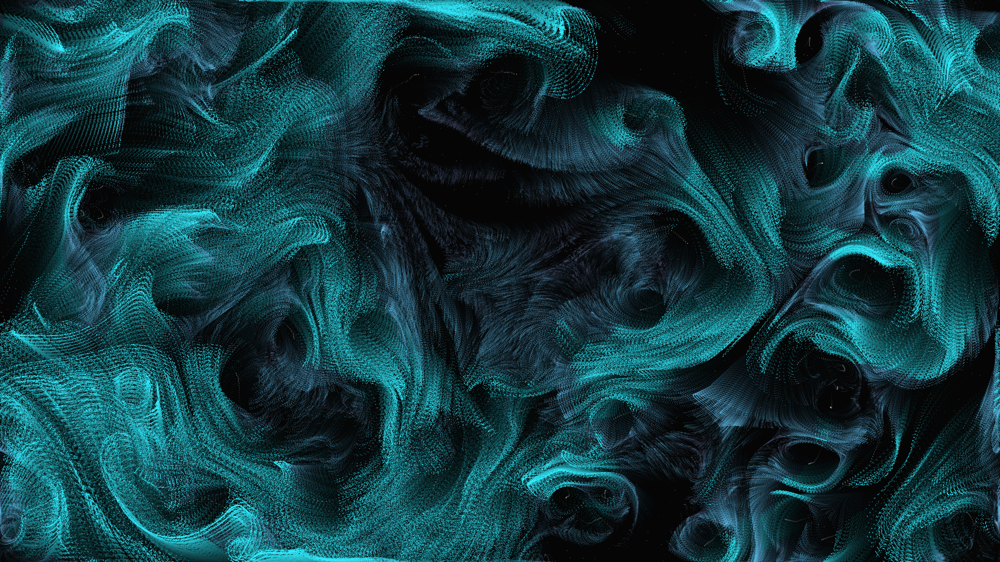

# superfluid_vortices

- **Date**: 2026-05-06
- **Theme**: Superfluidity, quantized vortices, Bose-Einstein condensate, beautiful night sky
- **Technique**: Vectorized point-vortex simulation (Biot-Savart law) using NumPy. 120 dynamic vortices and 120,000 particle tracers. The velocity field is calculated as the sum of rotations from all active vortices. Tracers follow the flow with high persistence and sub-pixel glow, creating a dense, iridescent tapestry of quantum turbulence. 60fps high-bitrate MP4 encoding.
- **Description**: A mesmerizing, shimmering visualization of quantum turbulence where 120,000 silken filaments in electric cyan, ice blue, and indigo swirl around invisible singularities; the intricate tapestry of phase-space resonance pulses against a dark, star-dusted night sky.

## Visuals

## Animation

[output.mp4](output.mp4)
