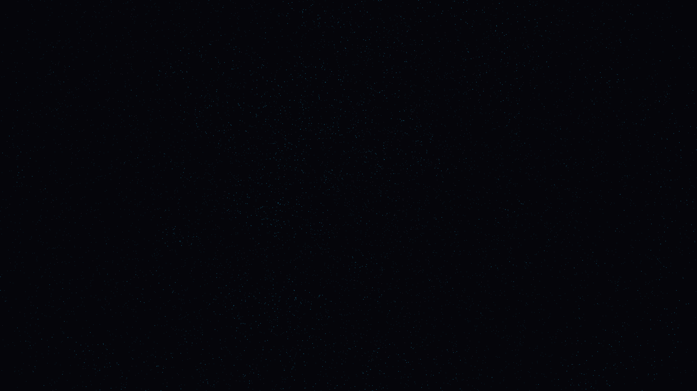

# supernova_light_echo

## Metadata
- **Date**: 2026-05-06
- **Theme**: Supernova, light echoes, interstellar dust, beautiful night sky.
- **Technique**: 3D simulation of a light echo phenomenon in a dense interstellar dust cloud (150,000 particles). Features a multi-octave Simplex noise-driven nebulosity that is progressively "unveiled" by an expanding spherical shell of light. Multi-pass additive rendering includes a bright white supernova core, shimmering electric blue dust filaments, and a high-density background starfield. 60fps high-bitrate MP4.
- **Logic Lab Reference**: None

## Concept
A central celestial explosion triggers a majestic wave of light that travels through the cosmic void, momentarily illuminating the intricate, silken structures of hidden gas clouds in spectral blue and silver against the silent obsidian night.

## Technical Details
- **Renderer**: P3D
- **Simulation**: particle.
- **Visuals**: additive blending, HSB spectral mapping, bloom-like highlights, prismatic color, dark-field contrast.
- **Animation**: 10 seconds at 60fps
