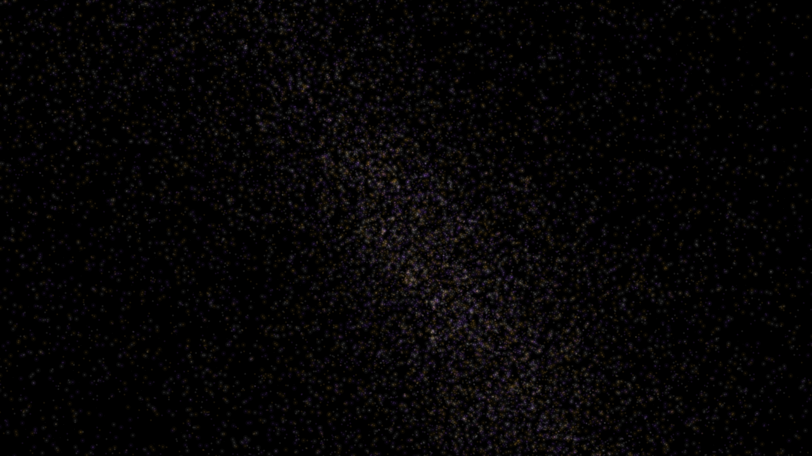

# supernova_nucleosynthesis_nebula

## Metadata
- **Date**: 2026-05-11
- **Theme**: Stellar evolution, supernova explosions, heavy element creation, nuclear physics, beautiful night sky.
- **Technique**: 3D blast wave simulation using an expanding shell of 80,000 particles with stochastic cooling and turbulence. Rendered with manual 3D-to-2D projection, multi-pass additive blending, and a "Deep Gold / Neon Violet / Star-White" palette. 15s 4K/60fps MP4.
- **Logic Lab Reference**: None

## Concept
A violent yet majestic expansion; a central core collapses and rebounds, sending a shimmering, variegated nebula of precious metals and stardust into the cosmic dark.

## Technical Details
- **Renderer**: P2D
- **Simulation**: particle.
- **Visuals**: additive blending, HSB spectral mapping, bloom-like highlights, prismatic color, dark-field contrast.
- **Animation**: 15 seconds at 60fps
