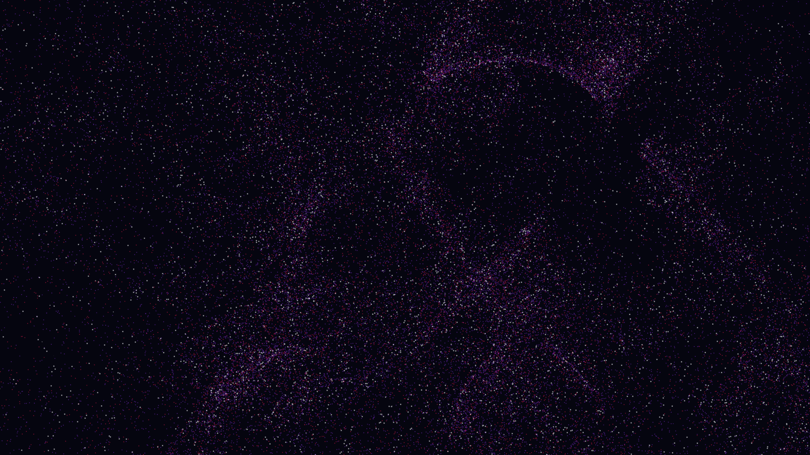

# supernova_remnant

## Metadata
- **Date**: 2026-05-05
- **Theme**: Supernova remnant, expanding shockwaves, interstellar dust, beautiful night sky.
- **Technique**: 3D particle simulation (120,000 particles) with radial shockwave expansion, multi-octave sine-based turbulence, velocity drag, multi-pass rendering (glow/core) for high-density volumetric feel, 60fps high-quality MP4 encoding.
- **Logic Lab Reference**: None

## Concept
A massive, explosive expansion of stardust that fragment into intricate filaments of electric violet and crimson; the work simulates the catastrophic death of a star and the subsequent formation of a shimmering nebula within the silent obsidian void.

## Technical Details
- **Renderer**: P3D
- **Simulation**: particle, 3D particle.
- **Visuals**: HSB spectral mapping, bloom-like highlights, prismatic color, dark-field contrast.
- **Animation**: 10 seconds at 60fps
