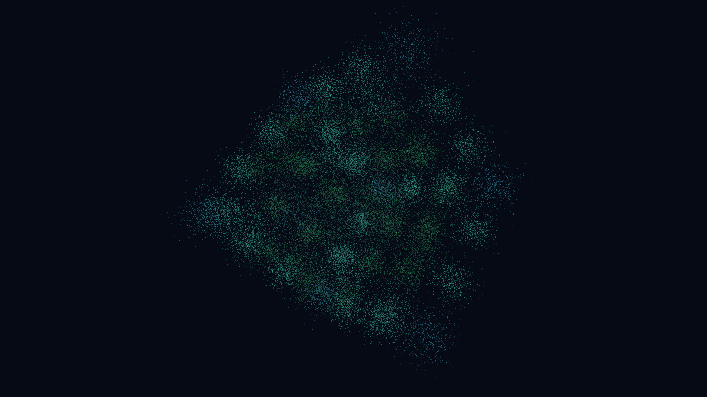

# supersolid_lattice_vibration

### Previews
- **Original 1080p:**
  
- **Upgraded 4K:**
  

## Metadata
- **Date**: 2026-05-12
- **Theme**: Quantum matter, supersolids, spontaneous translational symmetry breaking, phonon-roton modes.
- **Technique**: 3D lattice simulation (100,000 particles). Lattice vibrations modeled as coupled oscillators or wave propagation. Multi-pass additive rendering with HSB spectral shifts. 15s 4K/60fps MP4 (1080p source).
- **Logic Lab Reference**: None

## Concept
A crystal-like 3D lattice of crystalline droplets shimmers in a cold vacuum, pulsing and vibrating with roton-like excitations in a coordinated wave-like dance.

## Technical Details
- **Renderer**: P3D
- **Simulation**: particle.
- **Visuals**: additive blending, HSB spectral mapping, prismatic color, dark-field contrast.
- **Animation**: 15 seconds at 60fps
