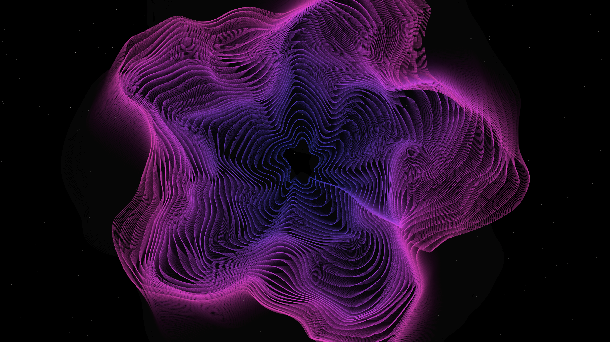

# supersymmetric_manifold

## Metadata
- **Date**: 2026-05-04
- **Theme**: High-dimensional geometry, spectral resonance, beautiful night sky.
- **Technique**: Layered Gielis Superformula, second-order domain warping, persistence-buffer trail accumulation, Retina-aware pixel-buffer compositing.
- **Logic Lab Reference**: None

## Concept
A shimmering, iridescent manifold of violet and cyan energy threads that pulses and vibrates in a deep star-dusted void; the complex geometric layers flow with a rhythmic "supersymmetric" breath, leaving glowing spectral echoes in their wake.

## Technical Details
- **Renderer**: P2D
- **Simulation**: Layered Gielis Superformula, second-order domain warping, persistence-buffer trail accumulation, Retina-aware pixel-buffer compositing.
- **Visuals**: HSB spectral mapping, pixel-buffer rendering, persistent trails, prismatic color, dark-field contrast.
- **Animation**: Still image
