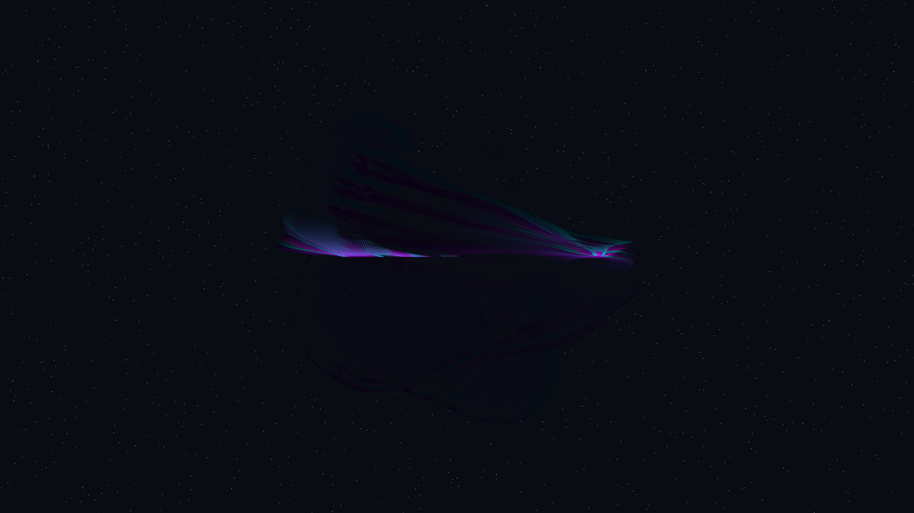

# supersymmetric_manifold_v2

- **Date**: 2026-05-05
- **Theme**: High-dimensional resonance, spectral motion, supersymmetric breath, beautiful night sky
- **Technique**: Animated Gielis Superformula (P3D), dynamic parameter modulation, persistent spectral trails, 60fps high-quality MP4 encoding
- **Description**: An animated evolution of the `supersymmetric_manifold`, responding to user feedback for a motion version; the shimmering energy manifold pulses and rotates through a deep star-dusted void, with its 8 spectral shells breathing in a complex, rhythmic harmony of electric indigo, cyan, and magenta.

## Preview

## Animation

The high-quality animation is saved as `output.mp4`.
