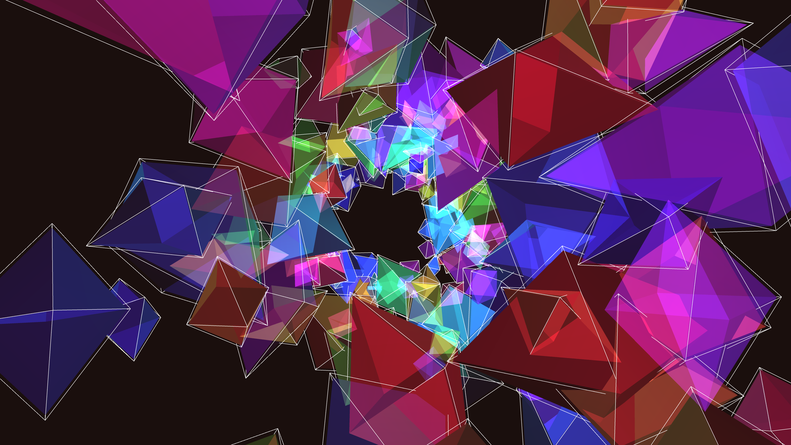

# surreal_crystal_cave_refractions_3d

## Metadata
- **Date**: 2026-06-15
- **Theme**: An animated 20s sequence of a 3D journey through a surreal cave made of crystalline structures that 
- **Technique**: 300 geometric crystals (octahedron-like primitives drawn with `py5.begin_shape(py5.TRIANGLES)`) are distributed along the walls of a deep cylindrical tunnel. The camera (`py5.camera`) flies through this tunnel continuously. The crystals rotate slowly, and `py5.ADD` blend mode with low opacity fills and point lights create glowing, refracted reflections. A wrapping logic ensures the tunnel stretches infinitely as the camera moves forward.
- **Logic Lab Reference**: 

## Concept
An animated 20s sequence of a 3D journey through a surreal cave made of crystalline structures that refract and reflect neon light, producing sharp geometric patterns.

## Technical Details
- **Renderer**: Unknown
- **Simulation**: Unknown
- **Visuals**: Unknown
- **Animation**: Unknown
