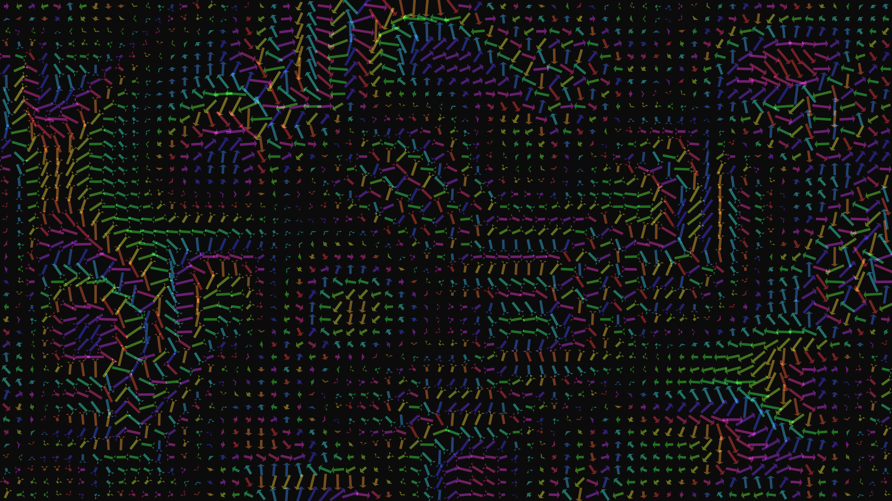

# surreal_fluid_flow_field_vectors_2d

## Metadata
- **Date**: 2026-06-15
- **Theme**: An animated 20s sequence of a high-contrast visualization of a 2D fluid flow field using thousands o
- **Technique**: A grid of arrow-like vectors is drawn where each arrow's angle and length are determined by a time-evolving Perlin noise field (`py5.os_noise`). The arrows use additive blending (`py5.ADD`) and leave slight motion blur trails. Colors shift hypnotically based on the angle of the noise field, creating a fluid, surreal motion.
- **Logic Lab Reference**: 

## Concept
An animated 20s sequence of a high-contrast visualization of a 2D fluid flow field using thousands of animated vectors that shift and twist based on a time-evolving noise field.

## Technical Details
- **Renderer**: Unknown
- **Simulation**: Unknown
- **Visuals**: Unknown
- **Animation**: Unknown
