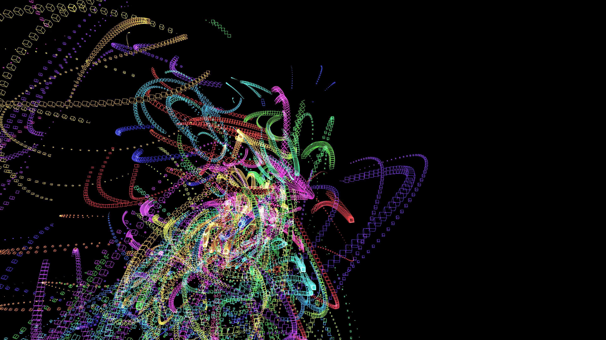

# surreal_fluid_plasma_turbulence_3d

## Description

An animated 20s sequence of surreal fluid plasma turbulence leaving glowing ribbons in a 3D volume.
The sketch utilizes a 3D particle simulation where coordinates are driven by 3D `py5.os_noise`. Additive blending and faint background clear create luminous overlapping motion trails. The hue of the trails shifts dynamically based on time and particle index, generating intense neon ribbons.

## Output

