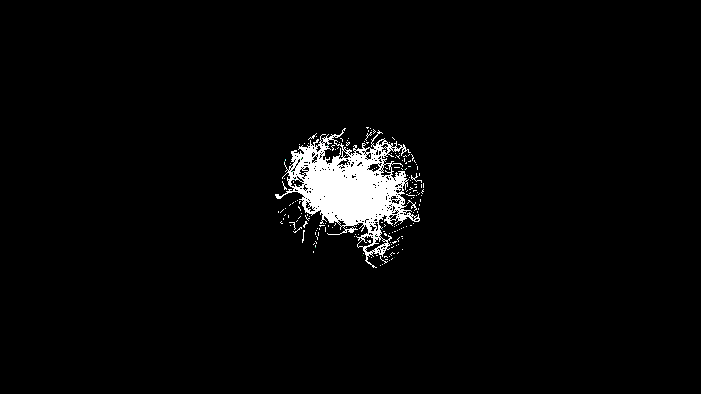

# surreal_luminescent_moss_growth_3d

## Metadata
- **Date**: 2026-06-17
- **Theme**: **Date**: 2026-06-17 **Format**: Animation (20s @ 60fps) **Theme**: A time-lapse of surreal luminesc
- **Technique**: Unknown
- **Logic Lab Reference**: 

## Concept
**Date**: 2026-06-17
**Format**: Animation (20s @ 60fps)
**Theme**: A time-lapse of surreal luminescent moss colonizing a dark monolithic structure in a deep, damp cave.
**Technique**: 3D particle simulation where agents crawl across a hidden mesh using vector flow and noise, leaving glowing additive-blended trails that harden into mossy clumps.

## Technical Details
- **Renderer**: Unknown
- **Simulation**: Unknown
- **Visuals**: Unknown
- **Animation**: Contains animation details
