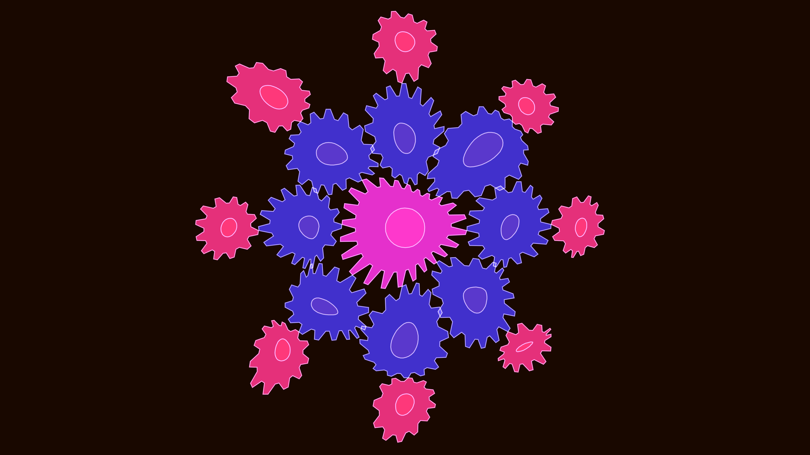

# surreal_non_euclidean_gearscape_2d

## Metadata
- **Date**: 2026-06-14
- **Theme**: An animated 15s sequence showing high-contrast neon magenta and deep indigo gears smoothly turning a
- **Technique**: 2D drawing of gears using procedural geometry. As the vertices of the gears are calculated, they are passed through a non-linear mathematical distortion using Perlin noise that scales based on their distance from a slow-moving center. This causes rigid rotating gears to appear to bend, stretch, and melt into each other.
- **Logic Lab Reference**: 

## Concept
An animated 15s sequence showing high-contrast neon magenta and deep indigo gears smoothly turning and distorting like liquid.

## Technical Details
- **Renderer**: Unknown
- **Simulation**: Unknown
- **Visuals**: Unknown
- **Animation**: Unknown
