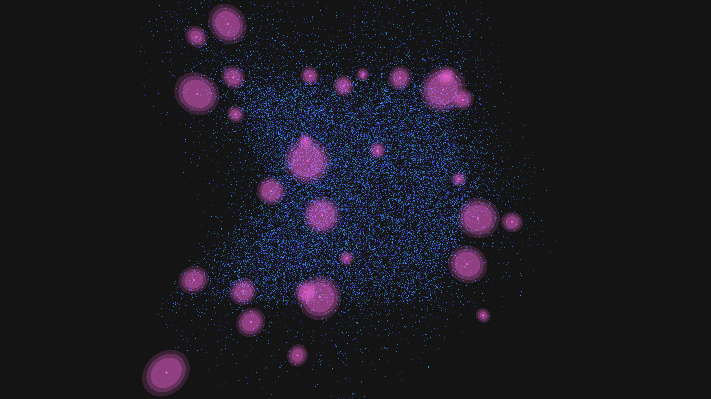

# synaptic_nebula

A physics-driven visualization of a bioluminescent neural nebula, exploring themes of cosmic biology and information flow.

- **Date**: 2026-05-06
- **Theme**: Cosmic biology, information flow, synaptic currents, beautiful night sky
- **Technique**:
    - **Physics**: 80,000 particles simulated using NumPy. They are attracted to a set of 30 "synaptic nodes" with a high-frequency noise perturbation.
    - **Visuals**: Vectorized particle rendering (Cyan/Violet/Rose) with pulsing HSB highlights.
    - **Flares**: Synaptic nodes feature multi-pass glow layers (spheres) that scale based on camera distance to create a sense of depth and activity.
    - **Animation**: 10 seconds @ 60fps, featuring a slow orbiting camera through the filaments.

