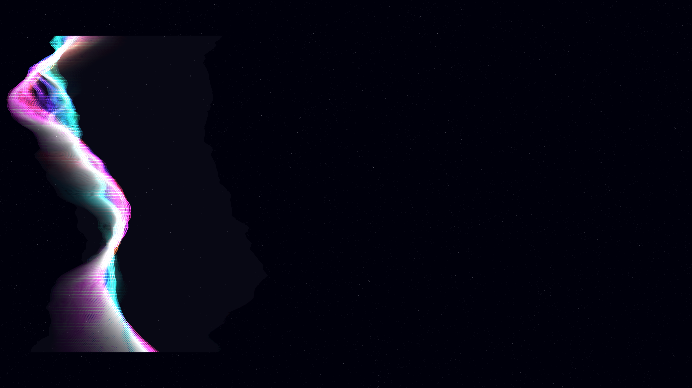

# synthetic_aurora

## Metadata
- **Date**: 2026-05-04
- **Theme**: Atmospheric phenomena, digital beauty, spectral currents, beautiful night sky.
- **Technique**: Noise-driven vertical Bezier curtains, chromatic aberration (RGB spatial split), persistence-buffer trail accumulation, additive P2D blending.
- **Logic Lab Reference**: None

## Concept
A digital reimagining of the Northern Lights where algorithmic curtains of light shimmer with iridescent chromatic fringes; deep emerald, cyan, and electric pink currents wave across a dark star-dusted void, leaving glowing spectral echoes in their wake.

## Technical Details
- **Renderer**: P2D
- **Simulation**: Noise-driven vertical Bezier curtains, chromatic aberration (RGB spatial split), persistence-buffer trail accumulation, additive P2D blendin.
- **Visuals**: additive blending, HSB spectral mapping, persistent trails, prismatic color, dark-field contrast.
- **Animation**: Animation
