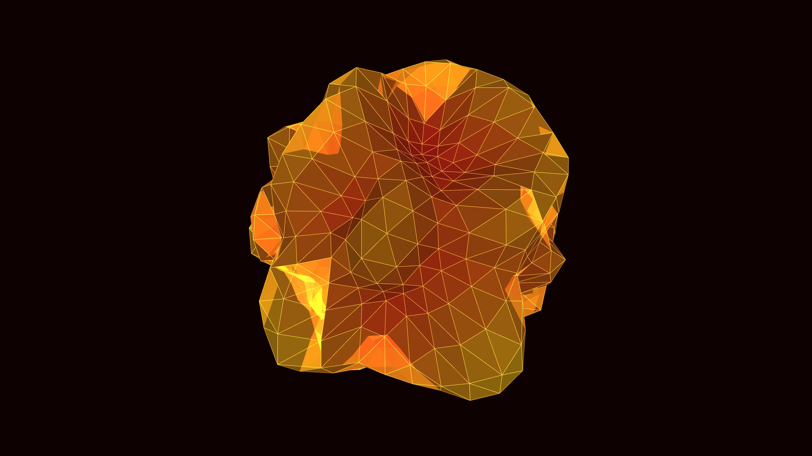

# synthetic_viral_capsid_geodesic_3d

## Metadata
- **Date**: 2026-05-31
- **Theme**: Generative Art
- **Technique**: Procedural generation of an icosahedron recursively subdivided into a high-density geodesic sphere. The spherical vertices are radially displaced in real-time using 3D OpenSimplex noise. Additive blending and dynamic coloring based on face normals create a glowing, organic microscopic aesthetic.
- **Logic Lab Reference**: 

## Concept
No concept description provided.

## Technical Details
- **Renderer**: Unknown
- **Simulation**: Unknown
- **Visuals**: Unknown
- **Animation**: Contains animation details
