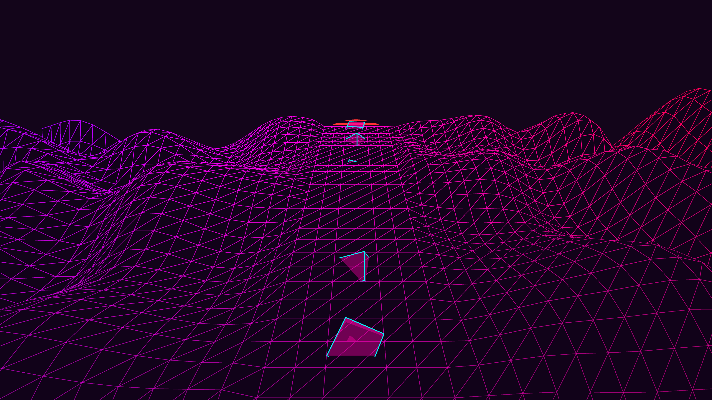

# synthwave_cyber_prism_highway_3d

## Metadata
- **Date**: 2026-06-05
- **Theme**: Generative Art
- **Technique**: Procedurally generated scrolling 3D wireframe terrain with a center highway path. Translating and rotating transparent geometric shapes flow along the highway with additive blending, anchored by a retro-futuristic digital sunset.  
- **Logic Lab Reference**: 

## Concept
No concept description provided.

## Technical Details
- **Renderer**: Unknown
- **Simulation**: Unknown
- **Visuals**: Unknown
- **Animation**: Contains animation details
