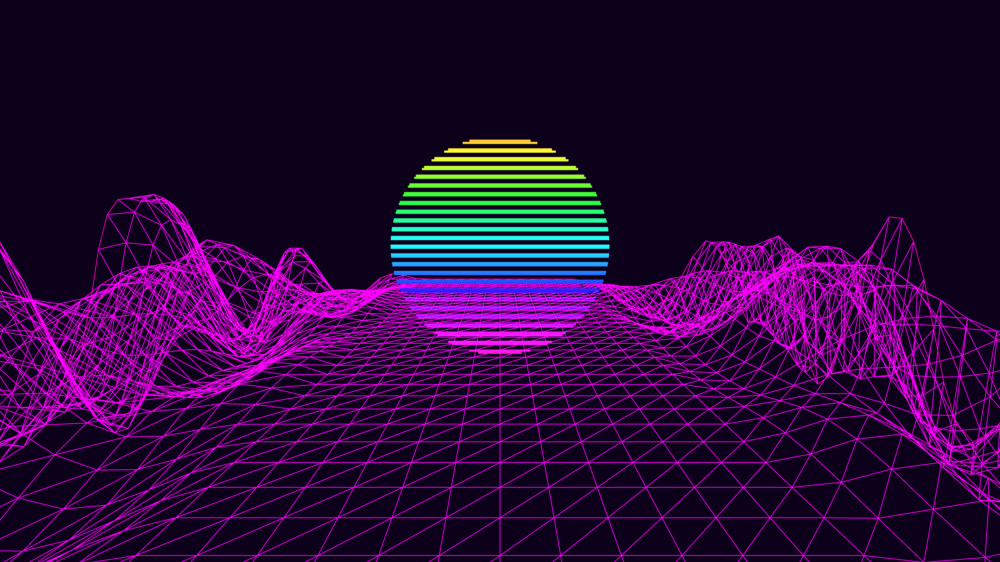

# synthwave_neon_grid_horizon

## Metadata
- **Date**: 2026-05-27
- **Theme**: - **Date**: 2026-05-27 - **Theme**: A classic synthwave/retrowave scene
- **Technique**: Unknown
- **Logic Lab Reference**: 

## Concept
- **Date**: 2026-05-27
- **Theme**: A classic synthwave/retrowave scene. A glowing neon wireframe grid rolls over a mountainous terrain toward the camera. In the background, a massive glowing sun slowly sinks or pulses.
- **Technique**: A 3D terrain grid generated with Perlin noise. The camera is fixed low to the ground. A large 2D circle with horizontal scanline cutouts is drawn in the background. Additive blending is used.
- **Description**: An animated 3D synthwave neon grid horizon.

## Technical Details
- **Renderer**: Unknown
- **Simulation**: Unknown
- **Visuals**: Unknown
- **Animation**: Unknown
