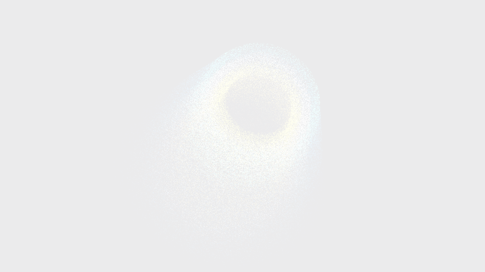

# taylor_couette_vortices

## Metadata
- **Date**: 2026-05-18
- **Theme**: The hydrodynamic transition of a fluid confined between concentric rotating cylinders, shifting from beautifully stacked, orderly toroidal vortices to undulating waves and chaotic turbulence.
- **Technique**: Vectorized 3D Navier-Stokes advection on a cylindrical coordinate grid representing Taylor-Couette flow, advecting 120,000 tracer particles. The simulation dynamically transitions from laminar Taylor vortex flow to wavy vortex flow by modulating the Taylor shear number over time. Projected manually into 3D space with slow cylindrical orbital rotation and depth fading.
- **Logic Lab Reference**: None

## Concept
A hollow cylinder of glowing sapphire tracers appears in the pitch-black void, slowly rotating. Within seconds, the cylinder organizes itself into a perfect vertical stack of six glowing toroidal rings of light. Tracers spiral inside each ring, flowing in opposite directions in alternate tori, while a molten amber core glows softly at the center. As the outer shear increases, the stacked tori sway and wave in an undulating rhythm before dissolving into a turbulent sienna and blue spray, accompanied by a dynamic volumetric camera shudder, then cleanly reforming.

## Technical Details
- **Renderer**: P2D
- **Simulation**: Vectorized analytical Navier-Stokes approximation of Taylor-Couette flow, integrated using Euler-Maruyama with periodic vertical boundaries.
- **Visuals**: Manual 3D perspective projection, volumetric depth shading, radial multi-region color grouping, and high-frequency camera shudder during the turbulent phase.
- **Animation**: 15 seconds at 60fps
