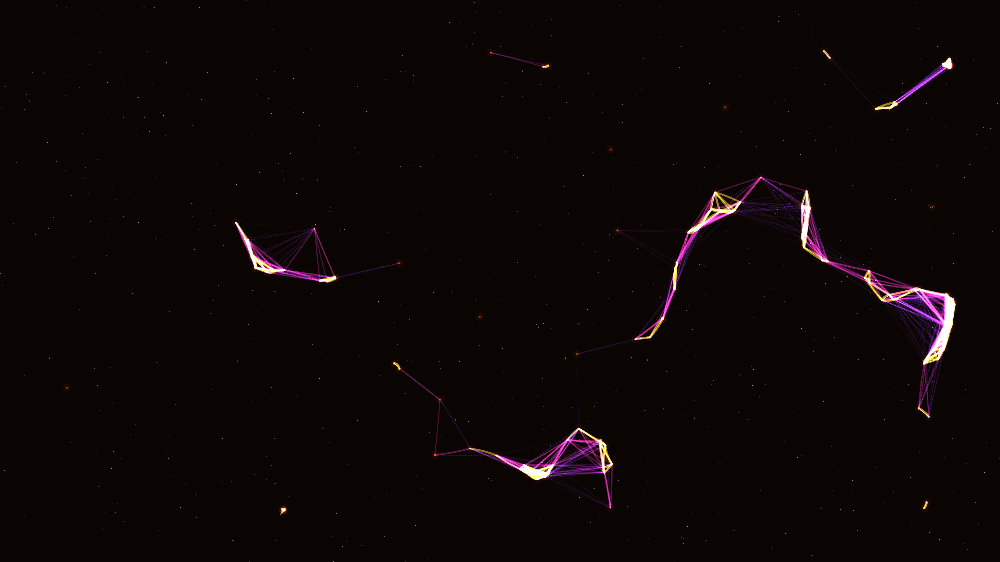

# tectonic_glow

## Metadata
- **Date**: 2026-05-05
- **Theme**: Planetary stress, seismic energy, crustal fractures, beautiful night sky
- **Technique**: Dynamic proximity mesh, stress-weighted spectral coloring, midpoint-displaced quadratic "cracks", noise-driven drift simulation

## Concept
A dark, planetary landscape where shifting tectonic plates create glowing fractures of molten gold and electric magenta; the jagged spectral cracks pulse with subterranean energy against a deep star-dusted night sky.

## Technical Details
- **Renderer**: P2D
- **Simulation**: Dynamic proximity mesh
- **Visuals**: stress-weighted spectral coloring, midpoint-displaced quadratic "cracks", noise-driven drift simulation
- **Animation**: 10s @ 60fps (typical)
