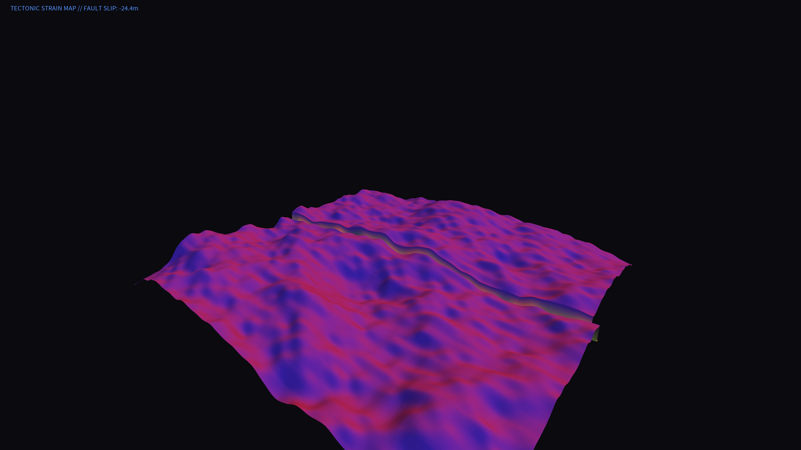

# tectonic_strain_topography

## Metadata
- **Date**: 2026-05-26
- **Theme**: A dynamic 3D topographic map showing shifting fault lines and stress accumulation, glowing in therma
- **Technique**: Uses a 3D `py5.QUAD_STRIP` mesh deformed by `py5.noise()` for the base terrain. A central fault line is animated using a sine wave offset, splitting the mesh into two dynamically shifting tectonic plates. The color and lighting adapt dynamically to the simulated strain (shift magnitude) to highlight areas of high stress.
- **Logic Lab Reference**: 

## Concept
A dynamic 3D topographic map showing shifting fault lines and stress accumulation, glowing in thermal reds and cool blues.

## Technical Details
- **Renderer**: Unknown
- **Simulation**: Unknown
- **Visuals**: Unknown
- **Animation**: Contains animation details
