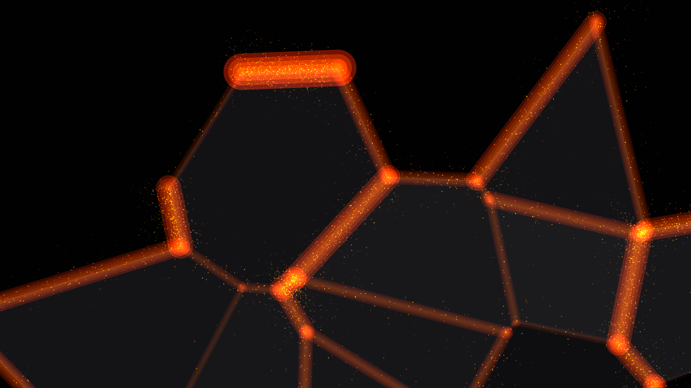

# tectonic_tension

## Metadata
- **Date**: 2026-05-03
- **Theme**: geology, physics, tectonics, volcanic energy.
- **Technique**: Voronoi-based plate simulation, ridge stress analysis, multi-layered additive glow, kinetic magma particles.
- **Logic Lab Reference**: None

## Concept
A visceral visualization of shifting geological plates; dark basalt slabs drift and collide, releasing intense orange magma glow and sparkling ejecta at the boundaries against a hazy, volcanic atmosphere.

## Technical Details
- **Renderer**: P2D
- **Simulation**: particle.
- **Visuals**: additive blending, bloom-like highlights, dark-field contrast.
- **Animation**: 5 seconds at 60fps
