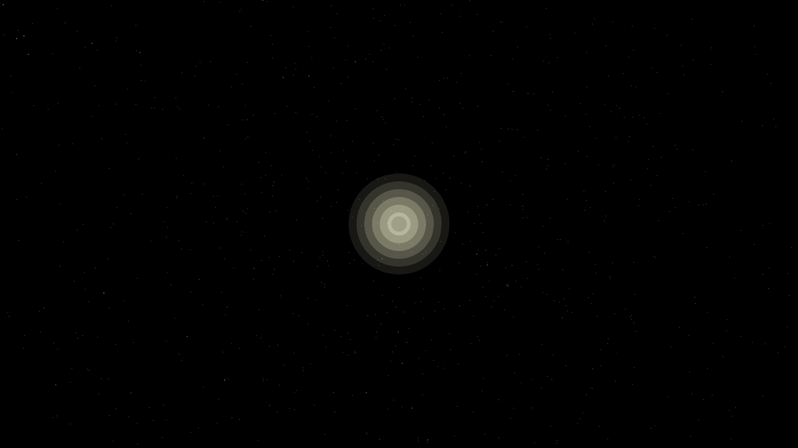

# tidal_disruption

## Metadata
- **Date**: 2026-05-06
- **Theme**: Cosmic catastrophe, spaghettification, event horizon, beautiful night sky.
- **Technique**: 3D particle simulation (180,000 particles) using a relativistic gravitational potential. A central "singularity" exerts non-linear tidal forces that stretch a spherical particle emitter into a long, twisting filament. Particles are colored by speed-based HSB (simulating Doppler shift and heating), with a multi-pass additive core glow for the photon ring. 60fps high-bitrate MP4.
- **Logic Lab Reference**: None

## Concept
A star's violent and beautiful death; caught in the immense gravity of a supermassive black hole, it is shredded into a glowing "noodle" of plasma that spirals toward the event horizon in a deep, star-dusted void.

## Technical Details
- **Renderer**: P3D
- **Simulation**: particle, 3D particle.
- **Visuals**: additive blending, HSB spectral mapping, bloom-like highlights.
- **Animation**: 10 seconds at 60fps
