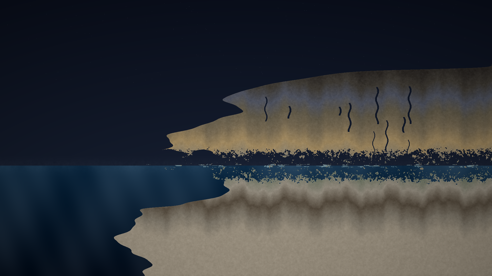

# tidal_erosion

**The ancient dialogue between ocean and stone**

## Concept

A cross-section of a coastal cliff reveals layered geological strata, undercut by centuries of wave action. The cliff face is sculpted by simulated tidal erosion — noisy patterns carve sea caves and notches at the waterline while vertical cracks propagate through the rock mass. Seafoam traces the active erosion zone.

## Technique

- **Procedural cliff geometry** — Multi-frequency sine profiles define the cliff face with an overhanging top and undercut erosion notch at waterline
- **2D fractal noise erosion** — 6-octave noise field multiplied by proximity-to-waterline weighting removes rock in organic, natural patterns
- **Sea cave generation** — Elliptical cavities with noise-perturbed boundaries create natural-looking erosion features
- **Wavy strata boundaries** — Sine-wave offsets make geological layer boundaries undulate naturally
- **Cliff surface detail** — Edge highlighting (soft glow on exposed faces), underside darkening (overhangs), vertical cracks, rock texture noise
- **Ocean rendering** — Multi-frequency wave texture, depth-based gradient, seafoam at waterline, mist spray
- **Vectorized numpy** — All rendering is fully vectorized for performance

## Palette

| Role | Color | Description |
|------|-------|-------------|
| Sky | `rgb(10, 15, 28)` → `rgb(28, 38, 58)` | Night sky gradient |
| Ocean | `rgb(22, 52, 78)` → `rgb(8, 18, 32)` | Surface to deep |
| Rock (12 strata) | Basalt → slate → sandstone → ochre → limestone | Geological age gradient |
| Accent | `rgb(128, 195, 185)` | Seafoam teal |

## Parameters

- 12 geological strata with wavy boundaries
- 3–6 sea caves per run with noise-perturbed shapes
- 5–15 vertical cracks
- 6-octave noise erosion field
- Each run produces a unique cliff profile
