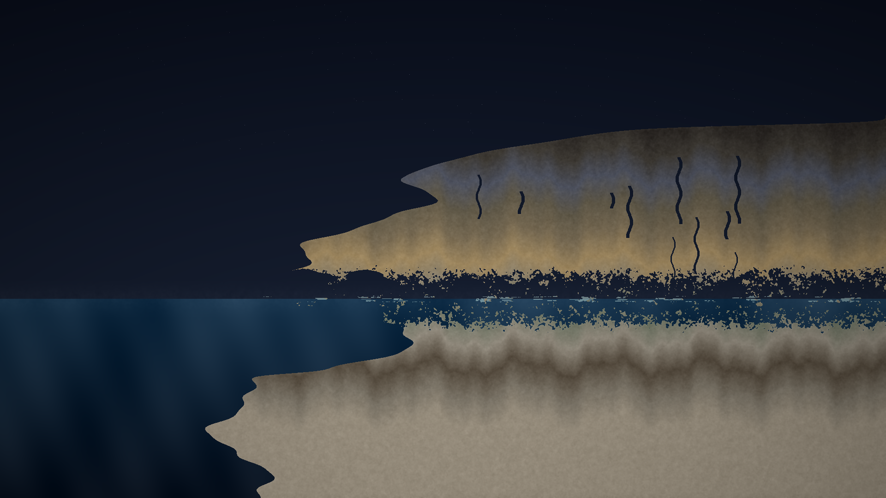

# tidal_erosion

## Metadata
- **Date**: 2026-04-26
- **Theme**: geology, coastal erosion, ocean, strata, natural forces.
- **Technique**: procedural cliff geometry with multi-frequency profiles, 2D fractal noise erosion weighted by waterline proximity, noise-perturbed sea caves, wavy strata boundaries, vectorized numpy rendering.
- **Logic Lab Reference**: None

## Concept
Cross-section coastal cliff with 12 geological strata progressively carved by simulated tidal erosion; noise-based erosion creates organic undercuts and sea caves at waterline; overhanging cliff face, vertical cracks, seafoam, and mist spray complete the scene.

## Technical Details
- **Renderer**: P2D
- **Simulation**: Vectorized NumPy, NumPy.
- **Visuals**: dark-field contrast.
- **Animation**: Still image
