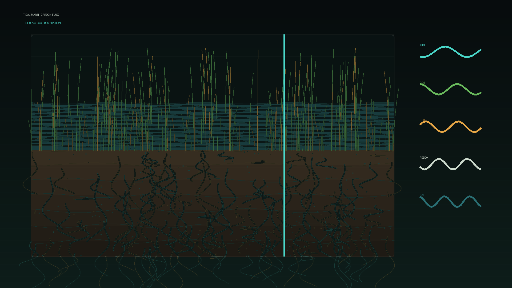

# tidal_marsh_carbon_flux

## Metadata
- **Date**: 2026-05-26
- **Theme**: Generative Art
- **Technique**: This 10-second 60fps animation renders a marsh cross-section with layered peat, moving tide height, swaying stems, root flux lines, carbon bubbles, and biogeochemical telemetry traces.
- **Logic Lab Reference**: 

## Concept
No concept description provided.

## Technical Details
- **Renderer**: Unknown
- **Simulation**: Unknown
- **Visuals**: Unknown
- **Animation**: Contains animation details
