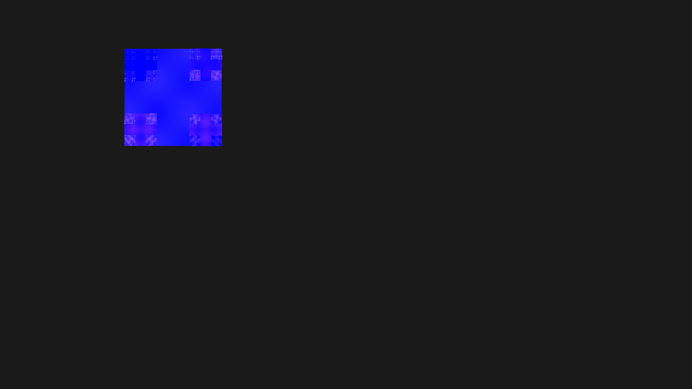

# tiled_fractal

## Metadata
- **Date**: 2026-04-28
- **Theme**: fractal geometry, recursion, organic asymmetry, tiling.
- **Technique**: recursive square subdivision with asymmetric quadrant sizes, rotation at each recursion level, dramatic color gradient transitions, seed-based organic variation.
- **Logic Lab Reference**: None

## Concept
A dynamic fractal pattern that breaks mechanical grid symmetry through organic asymmetry and rotation; squares subdivide asymmetrically with 22.5° rotation increments, creating visual movement with dramatic color transitions from deep emerald to bright teal and deep amber to bright coral against deep charcoal.

## Technical Details
- **Renderer**: P2D
- **Simulation**: recursive.
- **Visuals**: layered py5 drawing.
- **Animation**: Still image
