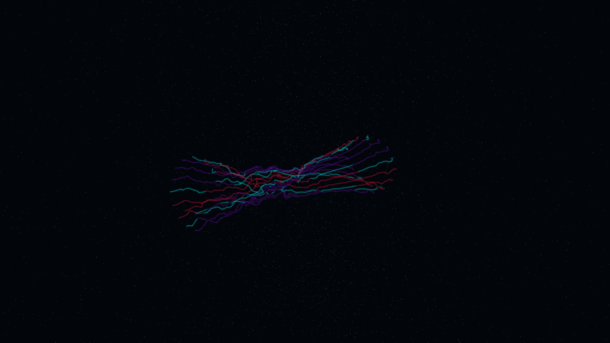

# topological_braid_flux

## Metadata
- **Date**: 2026-05-08
- **Theme**: Topology, knot theory, braid groups, cosmic threads, beautiful night sky.
- **Technique**: 3D simulation of 16 "braid threads" evolved through a combined helical vortex flow and Perlin noise field. Each thread is a complex polyline whose crossing patterns are driven by phase-shifted oscillators and global rotation. Features multi-pass additive line rendering with a "Royal Purple/Electric Cyan/Crimson" palette and an integrated high-density background starfield. 60fps high-bitrate MP4.
- **Logic Lab Reference**: None

## Concept
A majestic dance of cosmic threads; silken braids of royal purple, cyan, and crimson light weave and tangle in a high-dimensional flow, representing the rhythmic connectivity of the vacuum against the star-dusted obsidian night.

## Technical Details
- **Renderer**: P3D
- **Simulation**: 3D simulation of 16 "braid threads" evolved through a combined helical vortex flow and Perlin noise field.
- **Visuals**: additive blending.
- **Animation**: 15 seconds at 60fps
