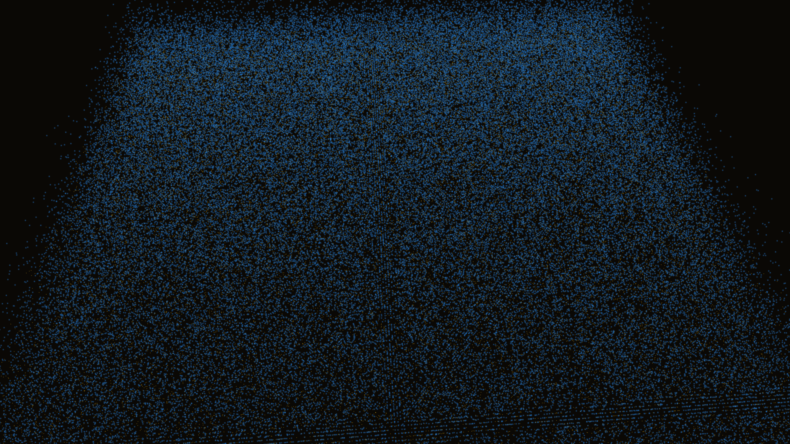

# topological_defect_string

### Previews
- **Original 1080p:**
  
- **Upgraded 4K:**
  

## Metadata
- **Date**: 2026-05-12
- **Theme**: Cosmology, early universe, symmetry breaking, cosmic strings, topological defects, phase transition.
- **Technique**: 2D complex scalar field simulation (Ginzburg-Landau type) with Mexican hat symmetry breaking. High-density point rendering of defect cores. 10s 4K/60fps MP4 (1080p source).
- **Logic Lab Reference**: None

## Concept
Visualizes the emergence of cosmic strings from a primordial gold field as the universe undergoes a symmetry-breaking phase transition.

## Technical Details
- **Renderer**: P3D
- **Simulation**: 2D complex scalar field simulation (Ginzburg-Landau type) with Mexican hat symmetry breaking.
- **Visuals**: HSB spectral mapping, bloom-like highlights, prismatic color, dark-field contrast.
- **Animation**: 10 seconds at 60fps
