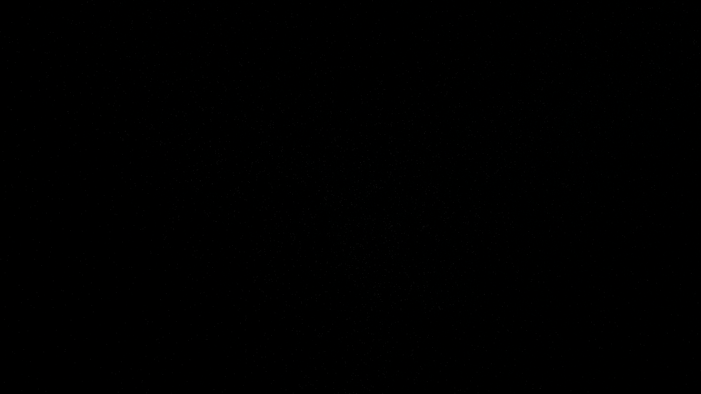

# topological_quantum_braid

## Metadata
- **Date**: 2026-05-08
- **Theme**: Quantum fluids, knotted vortices, braid topology, superfluidity, beautiful night sky.
- **Technique**: 3D simulation of a topological quantum fluid featuring a knotted vortex filament (Trefoil knot). 150,000 particles are advected via the Biot-Savart velocity field generated by the knotted core using vectorized NumPy with chunked point broadcasting. The knot undergoes a slow topological braid transformation. Features multi-pass additive rendering with a "Neon Emerald/Cyan/Indigo" HSB palette and a high-density background starfield (12,000 stars). 60fps high-bitrate MP4.
- **Logic Lab Reference**: None

## Concept
A majestic, shimmering vision of a quantum fluid; silken filaments of electric emerald and cyan energy swirl and knot into a complex trefoil braid that pulses with hidden resonance against the star-dusted obsidian void.

## Technical Details
- **Renderer**: P3D
- **Simulation**: Vectorized NumPy, NumPy, particle.
- **Visuals**: additive blending, HSB spectral mapping.
- **Animation**: 15 seconds at 60fps
