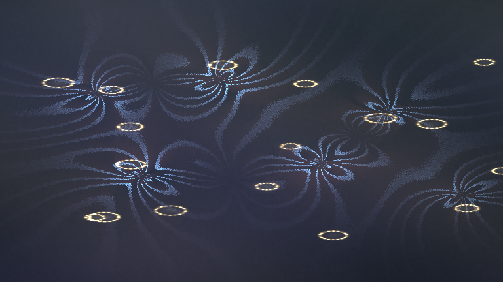

# triboelectric_pollen_cloud

## Metadata
- **Date**: 2026-05-10
- **Theme**: charged pollen grains suspended in a dim air column, pulled by invisible static-electric fields.
- **Technique**: Procedural electrostatic-potential animation with moving positive and negative charge centers. Vectorized field-line synthesis maps potential phase and field magnitude into blue-violet corona arcs, while ring-shaped pollen shells and a fading charge-memory buffer create warm golden grains and residual ion trails. 10s 4K/60fps MP4, generated as `output.mp4` and mirrored to `triboelectric_pollen_cloud.mp4`.
- **Logic Lab Reference**: None

## Concept
Golden pollen rings drift through a smoky blue-violet chamber as static field lines curl and snap around them, leaving faint electric traces like charged dust suspended in quiet air.

## Technical Details
- **Renderer**: P2D
- **Simulation**: Procedural electrostatic-potential animation with moving positive and negative charge centers.
- **Visuals**: persistent trails, bloom-like highlights, dark-field contrast.
- **Animation**: 10 seconds at 60fps
