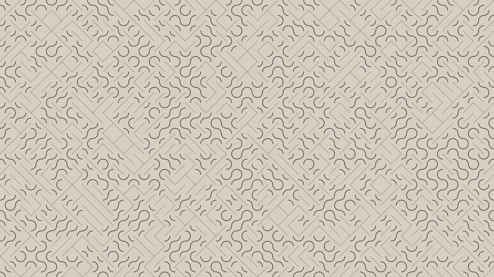

# Truchet Tiles

Each of 576 square tiles randomly receives one of two orientations: quarter-circle arcs connecting either the top-left and bottom-right corners, or the top-right and bottom-left corners. The arcs connect seamlessly across tile boundaries, producing emergent S-curves, loops, and wave trains. Rose-coral marks one orientation family; cyan-teal the other — two colors, two rotations, infinite pattern variation.
