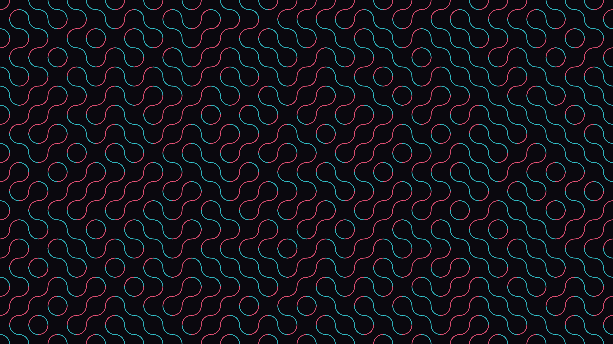

# truchet_tiles

## Metadata
- **Date**: 2026-04-25
- **Theme**: algorithmic tiling, geometry, emergence.
- **Technique**: Truchet quarter-circle arc tiling, binary random orientation, two-color complementary palette.
- **Logic Lab Reference**: None

## Concept
576 tiles each randomly assigned one of two arc orientations; arcs connect seamlessly at boundaries producing emergent S-curves, loops, and wave trains in rose-coral and cyan-teal on black.

## Technical Details
- **Renderer**: P2D
- **Simulation**: Truchet quarter-circle arc tiling, binary random orientation, two-color complementary palette.
- **Visuals**: layered py5 drawing.
- **Animation**: Still image
