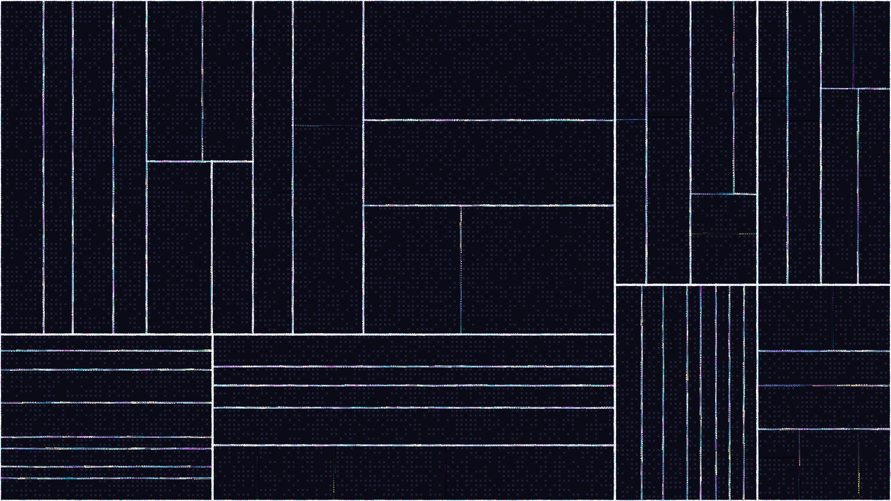

# urban_pulse

## Metadata
- **Date**: 2026-05-03
- **Theme**: urbanism, connectivity, kinetic energy, modern city, data flow
- **Technique**: Recursive grid subdivision, Manhattan-distance flow field, pulse-modulated particle brightness, architectural window grid synthesis

## Concept
A top-down "satellite" view of a glowing digital city; 40,000 particles surge through a Manhattan-grid street network in neon cyan and magenta, while flickering window grids in dark blocks create a dense architectural texture synchronized to a global "pulse" heartbeat.

## Technical Details
- **Renderer**: P2D
- **Simulation**: Recursive grid subdivision
- **Visuals**: Manhattan-distance flow field, pulse-modulated particle brightness, architectural window grid synthesis
- **Animation**: 10s @ 60fps (typical)
