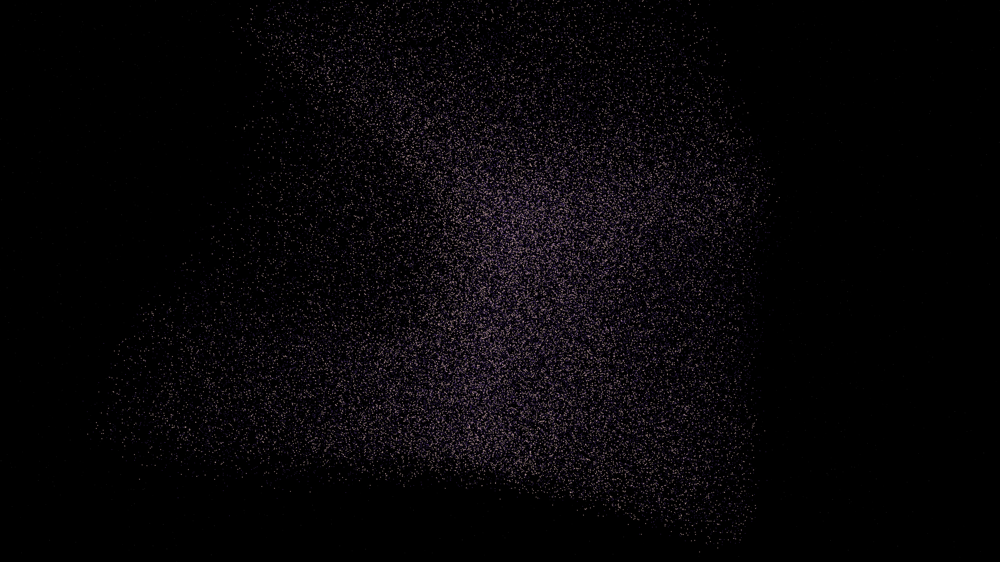

# vacuum_fluctuations

## Metadata
- **Date**: 2026-05-05
- **Theme**: Quantum physics, virtual particles, zero-point energy, beautiful night sky.
- **Technique**: - Vectorized multi-wave field synthesis (12 oscillators) - Stochastic excitation thresholding - Transient entanglement link simulation (proximity-based) - Additive blending for luminous effects - Dense twinkling starfield.
- **Logic Lab Reference**: None

## Concept
This work visualizes the concept of quantum zero-point energy, where the vacuum is not truly empty but a bubbling sea of virtual particles. Tiny, ephemeral points of light emerge from the obsidian void and vanish within milliseconds. Ghostly, cyan "entanglement" threads momentarily connect nearby fluctuating violet excitations, revealing the hidden connectivity and rhythmic vibration of the underlying space-time fabric.

## Technical Details
- **Renderer**: P2D
- **Simulation**: - Vectorized multi-wave field synthesis (12 oscillators) - Stochastic excitation thresholding - Transient entanglement link simulation (prox.
- **Visuals**: additive blending, HSB spectral mapping, bloom-like highlights, prismatic color, dark-field contrast.
- **Animation**: 10 seconds at 60fps
