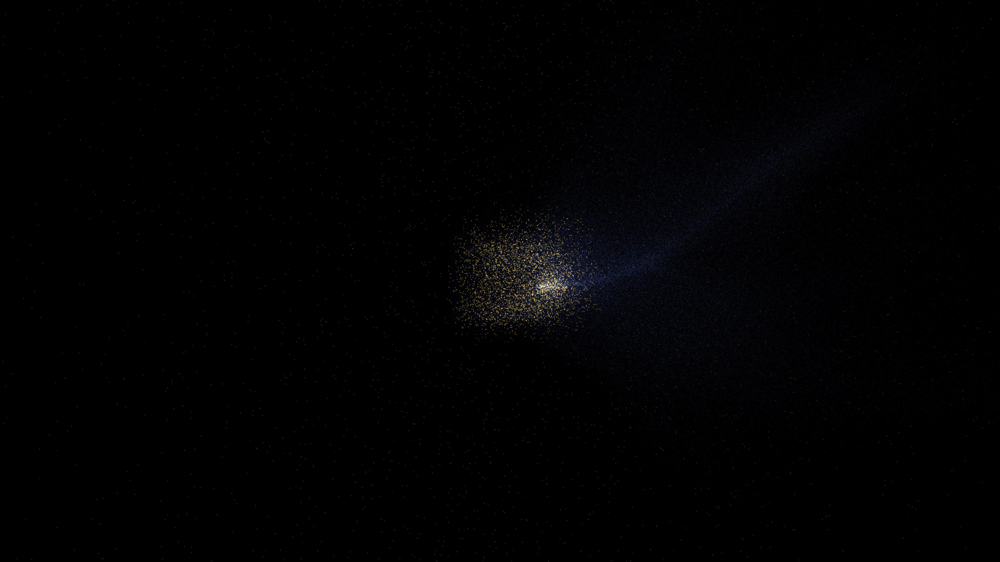

# vacuum_polarization_resonance

## Metadata
- **Date**: 2026-05-08
- **Theme**: Vacuum polarization, virtual particle pairs, dipole resonance, quantum electrodynamics, beautiful night sky.
- **Technique**: 3D high-density particle simulation (200,000 particles) using vectorized NumPy. Particles are emitted as "virtual pairs" from a central region and advected by a dynamic 3D dipole electric field, creating polarized filaments. Visibility (alpha) is modulated by local field strength and particle lifetime. Features multi-pass additive rendering with a Cyan/Amethyst/Indigo palette and a high-density starfield (12,000 stars). 60fps high-bitrate MP4.
- **Logic Lab Reference**: None

## Concept
A majestic, shimmering vision of the quantum vacuum; silken threads of electric cyan and royal amethyst energy polarize and align around an invisible dipole, creating an intricate tapestry of virtual light against the star-dusted obsidian void.

## Technical Details
- **Renderer**: P3D
- **Simulation**: Vectorized NumPy, NumPy, particle.
- **Visuals**: additive blending.
- **Animation**: 15 seconds at 60fps
