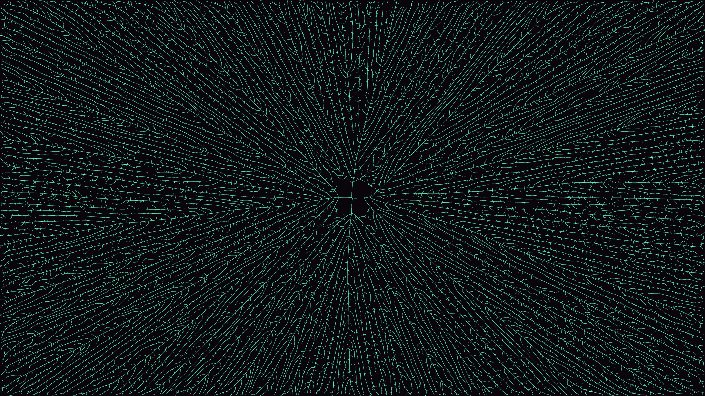

# vascular_space_colonization

A vast neural network or mycelial web sprawling outwards to consume floating energy clusters.

## Details

- **Date**: 2026-05-31
- **Theme**: A vast neural network or mycelial web sprawling outwards to consume floating energy clusters.
- **Technique**: Space Colonization Algorithm. Thousands of floating "attractor" points pull growing branches towards them. When a branch gets close enough, it consumes the attractor. The algorithm is heavily vectorized using `scipy.spatial.cKDTree` to simulate 60,000 attractors and tens of thousands of branches in real-time.
- **Palette**: Pitch black void with glowing cyan branch structures stretching towards pinkish neon energy spores.

## Previews



## Usage

```bash
uv run python main.py
```
