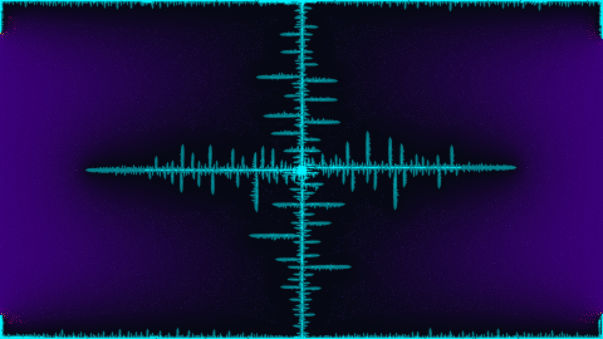

# viscous_fingering_hele_shaw

## Metadata
- **Date**: 2026-05-17
- **Theme**: Saffman-Taylor instability, viscous fingering, fluid confinement, fractal branching, competitive growth
- **Technique**: Grid-based discrete Laplace equation solver via Jacobi relaxation, Dielectric Breakdown Model (DBM) boundary growth with pre-cached Gaussian-smoothed spatial noise, and high-density advected flow tracer simulation
- **Logic Lab Reference**: `fluids/hele_shaw/saffman_taylor.py`

## Concept
*viscous_fingering_hele_shaw* captures the mesmerizing fluid dynamics of the Saffman-Taylor instability, which occurs when a lower-viscosity fluid is injected into a higher-viscosity medium within a narrow gap (a Hele-Shaw cell). 

At its core, this artwork represents the struggle of an invading substance finding the path of least resistance. Rather than expanding uniformly, the boundary buckles, generating sharp finger-like structures. In a feedback loop of physical instability, the tips of these fingers concentrate the local pressure gradients, causing them to accelerate and split into elegant, competitive branching fractals. 

The color palette is selected to give this microscopic phenomenon a cosmic, celestial majesty. The invading fluid glows with intense neon teal and electric cyan, while its active tips erupt with blinding gold-copper light as they drive outward. The displaced viscous fluid is visualized as a deep, mysterious royal indigo fog, through which 80,000 silken particles swarm and curve along the field lines, mapping the invisible hydrodynamic forces at play.

## Technical Details
- **Renderer**: P2D (OpenGL)
- **Simulation**: Vectorized NumPy physics solver operating on a 480×270 grid, with Jacobi relaxation solving $\nabla^2 p = 0$ at 30 iterations per frame. Interface growth is governed by DBM-style boundary propagation with an exponent of $\eta = 2.0$, normalized to ensure constant, elegant expansion.
- **Visuals**: Vectorized linear interpolation blending, automated bilinear scaling via OpenGL, and multi-velocity point styling (drawing 80,000 tracer particles grouped into three speed classes with custom opacity and weight).
- **Animation**: 15 seconds at 60 frames per second (900 total frames), compiled into high-fidelity 4K MP4.
