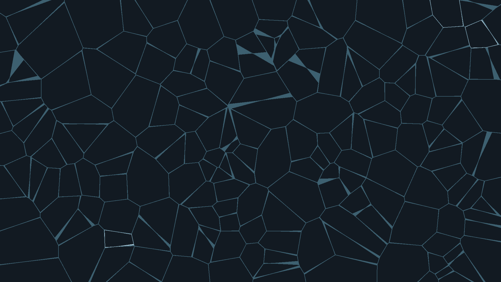

# Voronoi Cells

220 random seed points partition the canvas into Voronoi cells, each filled with a warm earth-tone palette. An exponential center-glow gradient lights each polygon from its centroid outward, and a thin dark border traces the exact geometric boundary — evoking stained glass, biological tissue, and geological cross-sections simultaneously.
