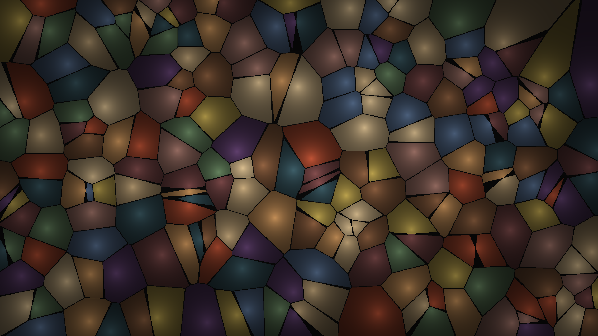

# voronoi_cells

## Metadata
- **Date**: 2026-04-25
- **Theme**: geometry, organic structure, spatial partitioning.
- **Technique**: Voronoi tessellation, banded numpy distance fields, center-glow gradient, earth-tone palette.
- **Logic Lab Reference**: None

## Concept
220 seed points partition the canvas into warm-toned Voronoi polygons with exponential center glow and sharp geometric borders, evoking stained glass and biological tissue.

## Technical Details
- **Renderer**: P2D
- **Simulation**: NumPy.
- **Visuals**: HSB spectral mapping, bloom-like highlights, prismatic color, dark-field contrast.
- **Animation**: Still image
