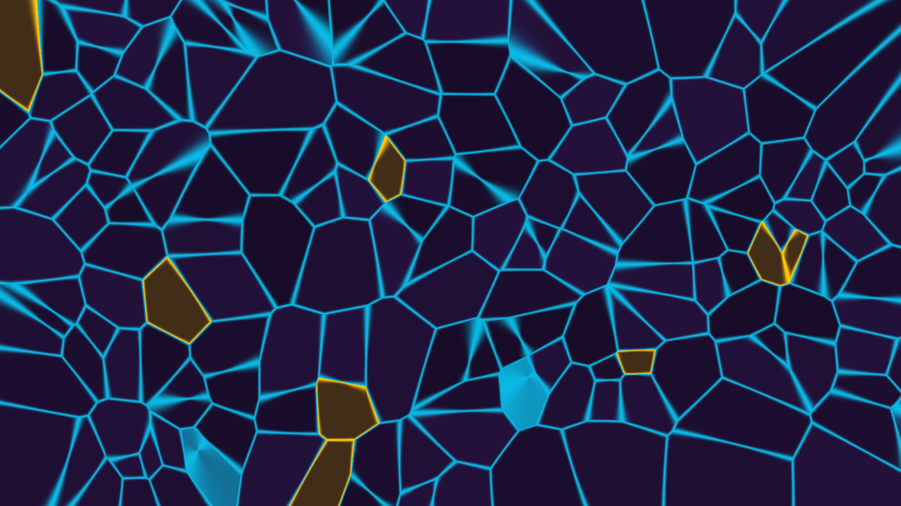

# voronoi_cells_v2

## Metadata
- **Date**: 2026-05-10
- **Theme**: abstract quantum cells, ethereal boundaries, fluid geometry, beautiful night sky.
- **Technique**: Vectorized 2D pixel-buffer manipulation (NumPy). Implements a noise-warped Voronoi tessellation where pixel coordinates are perturbed by multi-harmonic sine/cosine fields before distance calculation. Features a soft-glow boundary rendering using an exponential falloff based on the second-order distance (d2-d1).
- **Logic Lab Reference**: None

## Concept
A majestic and ethereal visualization of cellular structure in a quantum field. Shimmering, fluid boundaries in luminous teal weave through a deep amethyst void, occasionally erupting into brilliant sparks of molten gold where the energy of the vacuum is concentrated.

## Technical Details
- **Renderer**: P2D
- **Simulation**: NumPy.
- **Visuals**: pixel-buffer rendering, bloom-like highlights.
- **Animation**: Still image
