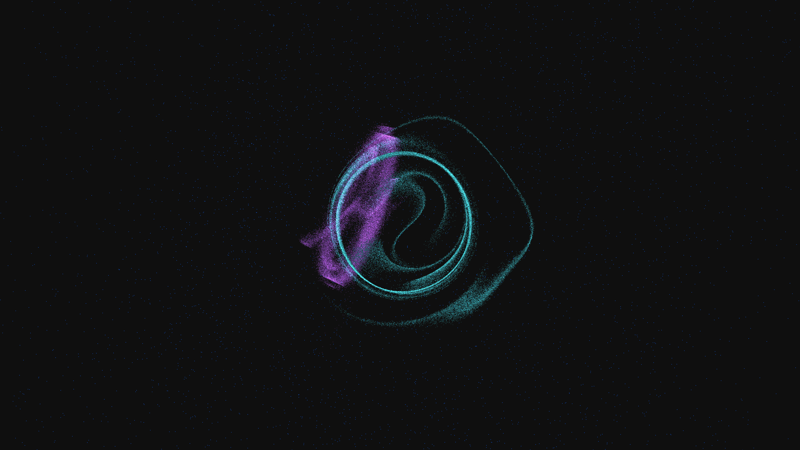

# vortex_phase_interference

## Metadata
- **Date**: 2026-05-09
- **Theme**: Quantum vortices, phase interference, superfluids, beautiful night sky.
- **Technique**: 3D simulation of two interacting vortex rings with 150,000 particle tracers. Particles follow a simplified Biot-Savart velocity field and rotate around ring cores. When rings approach, their phase-velocity fields interfere, creating complex bridging structures. Multi-pass additive rendering with a "Electric Cyan / Royal Violet" HSB palette and a high-density background starfield. 20fps high-bitrate MP4.
- **Logic Lab Reference**: None

## Concept
A mesmerizing visualization of interacting quantum vortex rings in a superfluid medium; silken filaments of electric cyan and royal violet energy dance and weave through the void, creating intricate bridging structures as they collide in the star-dusted obsidian night.

## Technical Details
- **Renderer**: P3D
- **Simulation**: particle.
- **Visuals**: additive blending, HSB spectral mapping.
- **Animation**: 20 seconds at 60fps
