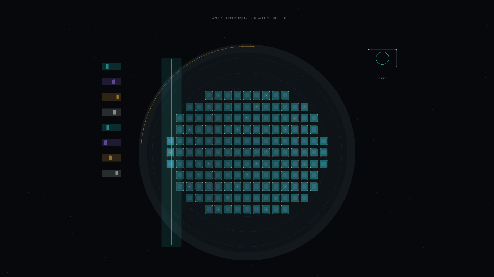

# wafer_stepper_drift

## Metadata
- **Date**: 2026-05-19
- **Theme**: A semiconductor wafer passing through a quiet lithography exposure cycle as alignment errors drift below perception.
- **Technique**: Procedural wafer die grid with dose accumulation, moving scanner slit, overlay-error vector field, alignment control pulses, and circular inspection sweep.
- **Logic Lab Reference**: None

## Concept
`wafer_stepper_drift` frames chip fabrication as a precise nocturnal ritual. The scanner slit travels across the die field, exposure dose accumulates in cyan and violet, and tiny amber vectors mark overlay drift that must be corrected before the pattern becomes physical.

## Technical Details
- **Renderer**: P2D
- **Simulation**: Wafer mask field with per-die dose accumulation, stochastic overlay drift, and periodic scan exposure
- **Visuals**: Dark cleanroom field, cyan/violet resist glow, amber alignment vectors, silver inspection geometry
- **Animation**: 10 seconds at 60fps, generating `output.mp4` and `wafer_stepper_drift_p1.png`
