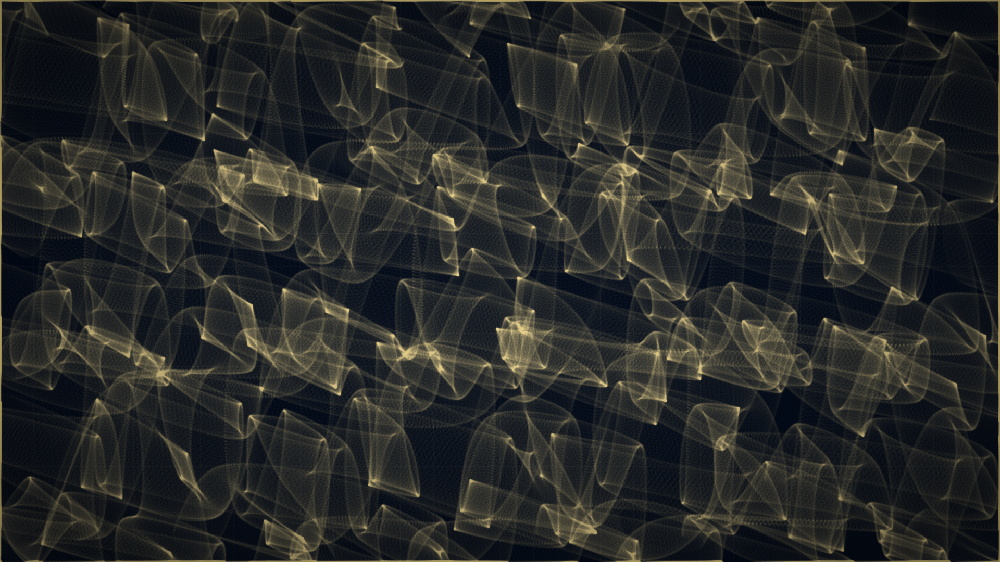

# water_caustics

## Metadata
- **Date**: 2026-04-26
- **Theme**: water, light, optics, physics, swimming pool, refraction.
- **Technique**: analytic sinusoidal wave surface, vector Snell's law refraction, bincount photon-density accumulation, three-zone tone mapping (floor / glow / flare), tile grid compositing.
- **Logic Lab Reference**: None

## Concept
Sunlight refracted through a random 8-wave water surface projected onto a virtual pool floor; bright caustic lines form a golden shimmering web where many rays converge, dark voids appear where they diverge, against a deep navy ceramic-tile floor.

## Technical Details
- **Renderer**: P2D
- **Simulation**: analytic sinusoidal wave surface, vector Snell's law refraction, bincount photon-density accumulation, three-zone tone mapping (floor / glow.
- **Visuals**: bloom-like highlights, dark-field contrast.
- **Animation**: Still image
