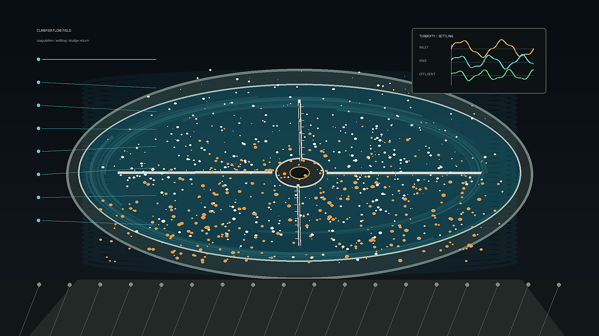

# water_treatment_clarifier

## Metadata
- **Date**: 2026-05-26
- **Theme**: A circular wastewater clarifier becomes a kinetic instrument: rake arms sweep through blue-green wat
- **Technique**: The animation is rendered headlessly with Pillow geometry. It layers elliptical tank bands, rotating bridge arms, hundreds of drifting floc particles, and oscilloscope-style process traces before encoding a 10-second 4K H.264 loop with ffmpeg.
- **Logic Lab Reference**: 

## Concept
A circular wastewater clarifier becomes a kinetic instrument: rake arms sweep through blue-green water, suspended floc settles toward a sludge floor, and a turbidity panel tracks inlet, rake, and effluent signals.

## Technical Details
- **Renderer**: Unknown
- **Simulation**: Unknown
- **Visuals**: Unknown
- **Animation**: Contains animation details
